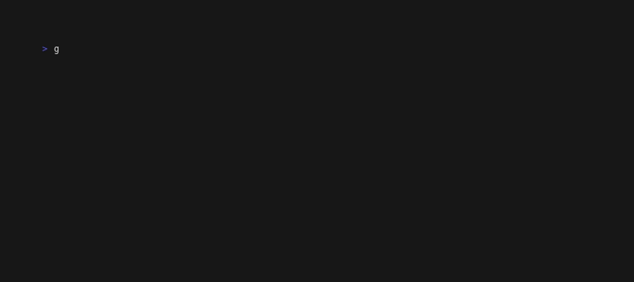

# Introduction



This is a **directory** picker bubble, a bubble being a component for
Bubble Tea applications. It was inspired by the [official filepicker
Bubble](https://github.com/charmbracelet/bubbles/tree/master/filepicker) — much of the code is taken directly from that example.

I had started with the intention to pare down that filepicker to the
simplicity of the [shopping list tutorial](https://github.com/charmbracelet/bubbletea?tab=readme-ov-file#tutorial) found in the Bubble Tea
README, but, as I learned more of the ropes, I began to realize why
some of the design elements of the original filepicker were there.

Note that, as a BubbleTea TUI application, the UI display is
essentially text, and so it's easy to present it here without relying
on an actual screenshot.

# Installation

`go get github.com/BrandonIrizarry/dirselect`

# Example

Here's some code that opens `dirselect`, then echoes the user's
selections back to the console:

```go
package main

import (
	"fmt"
	"log"

	"github.com/BrandonIrizarry/dirselect"
	tea "github.com/charmbracelet/bubbletea"
)

func main() {
	ds, err := dirselect.New()
	if err != nil {
		log.Fatal(err)
	}

	p := tea.NewProgram(ds)
	m, err := p.Run()
	if err != nil {
		log.Fatal(err)
	}

	ds2 := m.(dirselect.Model)

	fmt.Printf("You selected: %v\n", ds2.SelectedDirs)
}
```

# Motivation

I needed something customizable and lightweight for my Gogent [REPL
frontend](https://github.com/BrandonIrizarry/gogent_repl). It's indeed possible to use the official filepicker for
selecting directories, but visually unintuitive since you must have
already entered a directory to select it. So I had the idea of
introducing a checkbox-selection mechanism:

**OK**

```
/home/me/
      CoolProject/
      ↪ I want this directory
      
      AwesomeProject/
```

**Better**

```
/home/me/
     [x] CoolProject/ → I want this directory
     [ ] AwesomeProject/
```

This also enables the selection of multiple directories, which the
model then provides to the client code.

